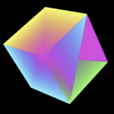
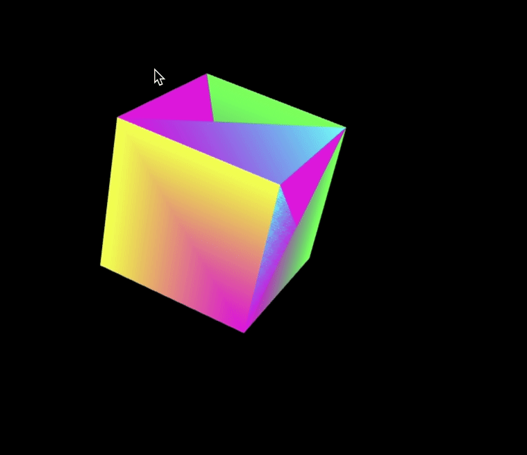
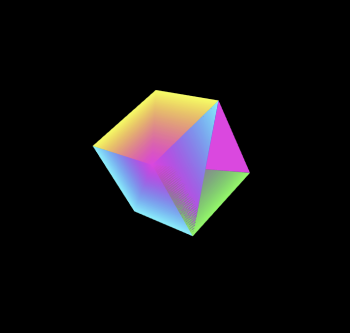

  
  <h1>3D Cube</h1>
  
  <h3>A 3D cube rotating according to mouse movement. </h3>

  <a href="https://3d-cubejs.netlify.app/"><h3>Try me!</h3></a>

  

  
  

## Technologies Used

&nbsp;&nbsp;&nbsp;&nbsp;&nbsp;&nbsp;

&nbsp;&nbsp;&nbsp;&nbsp;&nbsp;&nbsp;

&nbsp;&nbsp;&nbsp;&nbsp;&nbsp;&nbsp;

&nbsp;&nbsp;&nbsp;&nbsp;&nbsp;&nbsp;

## Description

A colorful three-dimensional cube that rotates to x-axis, y-axis, and z-axis according to the movement of  the mouse inside the window. It is created dynamically on page load, according to window dimensions. It is housed in a simple HTML page, with some essential CSS.

Originally, I created it using <a href="https://processing.org/">Processing</a>, and then I ported it to the web using Processing's JavaScript sibling, p5.js.

## License

Copyright (c) 2022 Michael Kolesidis 
Licensed under the [GNU General Public License v3.0](https://github.com/michaelkolesidis/webproject-script/blob/main/LICENSE).

## Demo

## Screenshot

 
 

[//]: # (Free Software)

   
   

  

                                                       

  

